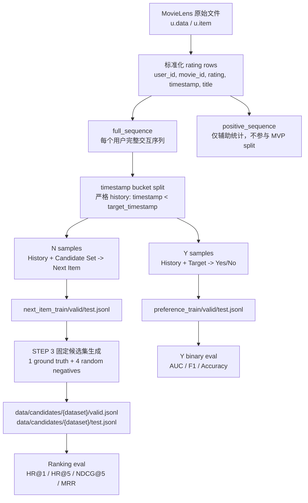

# 当前数据流说明

## 先记住一句话

当前项目的数据流分两层：

```text
STEP 2：把 MovieLens 原始评分变成 Y/N 任务样本。
STEP 3：把 N 的 validation/test 样本变成所有模型共用的排序考试卷。
```

所以不要把这三类文件混在一起：

```text
preference_valid/test.jsonl
  -> Y 的 Yes/No 二分类评测。

next_item_valid/test.jsonl
  -> N 的数据层 validation/test 样本，也是 STEP 3 生成固定候选集的来源。

data/candidates/{dataset}/valid/test.jsonl
  -> 后续所有排序评测共用的固定候选集。
```

## 总图



## 输入从哪里来

当前开发数据集是 MovieLens-100K；MovieLens-32M 已生成本地 eval-only 评测包。

配置在 `configs/experiment.yaml`：

```text
ratings: data/raw/ml-100k/u.data
movies:  data/raw/ml-100k/u.item
positive_rating_threshold: 4
history_length: 10
candidate_num: 5
seed: 42
```

`src/data/preprocess.py` 做两件事：

1. 读取评分文件和电影元数据。
2. 按用户构造两个序列。

两个序列是：

```text
full_sequence
  每个用户的完整评分交互，评分 1 到 5 都保留。

positive_sequence
  只保留 rating >= 4 的交互。
  当前只用于统计或 Phase 2，不参与 MVP 的 split，不决定 N target。
```

当前 MVP 的主序列永远是：

```text
full_sequence
```

## STEP 2 做了什么

入口是：

```bash
python -m src.data.build_step2 --config configs/experiment.yaml --dataset movielens-100k
```

它按顺序调用：

```text
load_ratings / load_movies
-> build_user_sequences
-> build_full_sequence_leave_two_out_split
-> build_preference_samples
-> build_next_item_samples
-> compute_dataset_stats
```

也就是：

```text
读原始数据
-> 建用户序列
-> 做时间切分
-> 生成 Y 样本
-> 生成 N 样本
-> 写统计和人工检查样本
```

## 时间切分到底怎么切

时间切分在 `src/data/split.py`。

所有任务都遵守同一个严格历史规则：

```text
history = 所有 timestamp < target_timestamp 的 interaction
```

同一个 timestamp 内没有真实先后顺序。所以：

```text
不能把同 timestamp 的其他电影放进 history。
不能用 movie_id 或文件顺序假装同 timestamp 有先后。
timestamp tie 不会删除整个用户。
```

这里的 `movie_id` 排序只用于让输出稳定，不代表真实时间顺序。

## Y 数据怎么来

Y 是：

```text
History + Target -> Yes / No
```

标签只看 target 的评分：

```text
rating >= 4 -> Yes
rating < 4  -> No
```

Y 的 split 按 timestamp bucket 切：

```text
最后一个 timestamp bucket       -> Y test
倒数第二个 timestamp bucket     -> Y validation
更早 timestamp buckets          -> Y train
```

如果同一个 timestamp bucket 里有多个电影，它们都可以成为 Y target，并且共享同一份严格 history。

Y 产物是：

```text
data/processed/movielens-100k/preference_samples.jsonl
data/processed/movielens-100k/preference_train.jsonl
data/processed/movielens-100k/preference_valid.jsonl
data/processed/movielens-100k/preference_test.jsonl
```

当前 100K 数量：

```text
Y users: 943
Y train: 95867
Y validation: 1985
Y test: 2148
```

一条 Y validation 样本大概长这样：

```json
{
  "task": "Y",
  "task_name": "yes_no_preference",
  "user_id": "196",
  "split": "validation",
  "history": ["若干 timestamp 更早的电影"],
  "target": {
    "movie_id": "94",
    "rating": 3.0,
    "timestamp": 881252172,
    "title": "Home Alone (1990)"
  },
  "label": "No",
  "positive_rating_threshold": 4.0
}
```

这条样本的意思是：

```text
给模型看用户历史和 Home Alone。
因为评分是 3，小于 4，所以正确输出是 No。
```

## N 数据怎么来

N 是：

```text
History + Candidate Set -> 实际发生的下一个 Item
```

注意：N 的 target 是下一次真实交互，不管评分高低。它不是“下一部喜欢的电影”。

N 只使用严格可确定的 next item：

```text
如果下一个 timestamp bucket 只有 1 个 interaction：
  可以构造 N 样本。

如果下一个 timestamp bucket 有多个 interaction：
  不知道这些 interaction 的内部真实顺序。
  跳过这个 N 样本。
  但不跳过整个用户。
```

每个用户先枚举所有合法 N 样本，再切：

```text
最后一个合法 N sample       -> N test
倒数第二个合法 N sample     -> N validation
更早合法 N samples          -> N train
```

N 产物是：

```text
data/processed/movielens-100k/next_item_train.jsonl
data/processed/movielens-100k/next_item_valid.jsonl
data/processed/movielens-100k/next_item_test.jsonl
```

当前 100K 数量：

```text
N users: 902
N train: 21995
N validation: 902
N test: 902
```

有 41 个用户因为合法 N 样本不足，没有进入 N 任务。但这些用户仍然可以进入 Y。

一条 N validation 样本大概长这样：

```json
{
  "task": "N",
  "task_name": "full_sequence_next_item",
  "user_id": "196",
  "split": "validation",
  "history": ["若干 timestamp 更早的电影"],
  "target": {
    "movie_id": "94",
    "rating": 3.0,
    "timestamp": 881252172,
    "title": "Home Alone (1990)"
  },
  "candidate_movie_ids": ["584", "739", "946", "262", "94"],
  "ground_truth_movie_id": "94",
  "ground_truth_index": 4,
  "label": "E",
  "label_set": ["A", "B", "C", "D", "E"]
}
```

这条样本的意思是：

```text
给模型看用户历史和 5 个候选。
真实下一次交互是 movie_id=94。
它在候选列表里的位置是 index=4，也就是 E。
```

## 为什么 N 文件里已经有候选，STEP 3 还要生成候选集

这是当前最容易混淆的地方。

现在的 `next_item_valid.jsonl` 和 `next_item_test.jsonl` 里确实也带了候选字段，因为 N 样本构造器使用了统一结构。

但正式排序评测不直接使用这些候选字段，而是使用 STEP 3 生成的固定候选集：

```text
data/candidates/{dataset}/valid.jsonl
data/candidates/{dataset}/test.jsonl
```

原因是实验公平。

后面会有很多模型或接口：

```text
Base-N
Y-K0 ranking mode
N-K0
M-Y ranking mode
M-N
```

它们必须面对同一批候选、同一候选顺序、同一 ground truth 位置。否则某个模型可能抽到更容易的负候选，另一个模型抽到更难的负候选，结果不能比较。

所以当前约定是：

```text
next_item_valid/test.jsonl
  是 N 的数据层样本，也是 STEP 3 的输入来源。

data/candidates/{dataset}/valid/test.jsonl
  是正式 ranking evaluation 的唯一固定候选集。
```

## STEP 3 做了什么

入口是：

```bash
python -m src.eval.candidate_sets --config configs/experiment.yaml --dataset movielens-100k
python -m src.eval.candidate_sets --config configs/experiment.yaml --dataset movielens-1m
python -m src.eval.candidate_sets --config configs/experiment.yaml --dataset movielens-32m
```

`src/eval/candidate_sets.py` 做这件事：

```text
读取 next_item_valid.jsonl
-> 取出 history 和真实 target
-> 为每条样本生成 4 个随机负候选
-> 加上 1 个真实 target
-> 打乱 A/B/C/D/E 顺序
-> 写出 data/candidates/{dataset}/valid.jsonl

读取 next_item_test.jsonl
-> 同样处理
-> 写出 data/candidates/{dataset}/test.jsonl
```

当前固定候选集：

```text
valid candidates: 902 records
test candidates: 902 records
candidate_num: 5
```

ground truth 位置分布：

```text
validation: index0 166 / index1 196 / index2 188 / index3 174 / index4 178
test:       index0 190 / index1 195 / index2 173 / index3 171 / index4 173
```

当前 32M 固定候选集：

```text
valid candidates: 193491 records
test candidates: 193491 records
candidate_num: 5
validation: index0 38826 / index1 38529 / index2 38882 / index3 38487 / index4 38767
test:       index0 38407 / index1 38527 / index2 38852 / index3 38701 / index4 39004
```

当前 1M 固定候选集：

```text
valid candidates: 5675 records
test candidates: 5675 records
candidate_num: 5
validation: index0 1090 / index1 1104 / index2 1128 / index3 1155 / index4 1198
test:       index0 1097 / index1 1140 / index2 1207 / index3 1111 / index4 1120
```

这个分布说明正确答案没有固定在 A/B/C/D/E 的某一个位置。

一条固定候选集记录大概长这样：

```json
{
  "dataset": "movielens-100k",
  "split": "validation",
  "source_task": "N",
  "user_id": "196",
  "history": ["若干 timestamp 更早的电影"],
  "target": {
    "movie_id": "94",
    "rating": 3.0,
    "timestamp": 881252172,
    "title": "Home Alone (1990)"
  },
  "candidate_movie_ids": ["1082", "1027", "94", "1415", "1337"],
  "ground_truth_movie_id": "94",
  "ground_truth_index": 2,
  "label": "C",
  "label_set": ["A", "B", "C", "D", "E"]
}
```

这就是后续 ranking 评测的固定考试卷。

## 后续各模型分别读什么

### Base

Base 不训练。

它有两种评测：

```text
Base-Y binary:
  读 preference_valid/test.jsonl
  输出 P(Yes), P(No)
  算 AUC / F1 / Accuracy

Base-N ranking:
  读 data/candidates/{dataset}/valid/test.jsonl
  输出 P(A), P(B), P(C), P(D), P(E)
  算 HR@1 / HR@5 / NDCG@5 / MRR
```

### Y-K0

Y-K0 训练时读：

```text
data/processed/movielens-100k/preference_train.jsonl
```

Y-K0 有两种评测：

```text
binary evaluation:
  读 preference_valid/test.jsonl
  对每条 History + Target 输出 P(Yes)
  算 AUC / F1 / Accuracy

ranking evaluation:
  读 data/candidates/{dataset}/valid/test.jsonl
  对 A/B/C/D/E 每个候选分别构造 History + Candidate
  分别输出 P(Yes)
  按 P(Yes) 从高到低排序
  算 HR@1 / HR@5 / NDCG@5 / MRR
```

这就是为什么 Y 也会用 `data/candidates`，但它不是用 A/B/C/D/E 作为训练标签，而是用 `P(Yes)` 给候选打分。

### N-K0

N-K0 训练时读：

```text
data/processed/movielens-100k/next_item_train.jsonl
```

N-K0 ranking evaluation 读：

```text
data/candidates/{dataset}/valid.jsonl
data/candidates/{dataset}/test.jsonl
```

模型对同一条候选集输出：

```text
P(A), P(B), P(C), P(D), P(E)
```

然后按候选标签概率排序。

### M-K0

M-K0 训练时读两个训练文件：

```text
Y_train: data/processed/movielens-100k/preference_train.jsonl
N_train: data/processed/movielens-100k/next_item_train.jsonl
```

训练方式默认是交替或混合：

```text
Y batch
N batch
Y batch
N batch
...
```

M-K0 评测必须分成两个模式：

```text
M-Y:
  像 Y-K0 一样评测 Yes/No。

M-N:
  像 N-K0 一样评测候选排序。
```

## 指标文件怎么用

`src/eval/binary_metrics.py` 用于 Y：

```text
AUC
F1
Accuracy
```

输入需要是：

```text
score = P(Yes)
label = Yes 或 No
```

`src/eval/ranking_metrics.py` 用于候选排序：

```text
HR@1
HR@5
NDCG@5
MRR
```

输入需要是：

```text
scores = 每个候选的分数
ground_truth_index = 正确候选位置
```

对于 N-K0 / M-N：

```text
scores = [P(A), P(B), P(C), P(D), P(E)]
```

对于 Y-K0 / M-Y 的 ranking mode：

```text
scores = [
  P(Yes | history, candidate A),
  P(Yes | history, candidate B),
  P(Yes | history, candidate C),
  P(Yes | history, candidate D),
  P(Yes | history, candidate E)
]
```

## 文件用途总表

| 文件 | 谁生成 | 谁使用 | 用途 |
| --- | --- | --- | --- |
| `full_sequences.jsonl` | STEP 2 | 数据构造与检查 | 每个用户完整交互序列 |
| `positive_sequences.jsonl` | STEP 2 | 统计 / Phase 2 | 当前 MVP 不参与 split |
| `split.json` | STEP 2 | Y/N 样本构造 | 记录 Y/N 时间切分 |
| `preference_train.jsonl` | STEP 2 | Y-K0 / M-K0 | Y 训练 |
| `preference_valid.jsonl` | STEP 2 | Base-Y / Y-K0 / M-Y | Y 二分类验证 |
| `preference_test.jsonl` | STEP 2 | Base-Y / Y-K0 / M-Y | Y 二分类测试 |
| `next_item_train.jsonl` | STEP 2 | N-K0 / M-K0 | N 训练 |
| `next_item_valid.jsonl` | STEP 2 | STEP 3 | 生成 validation 固定候选集的来源 |
| `next_item_test.jsonl` | STEP 2 | STEP 3 | 生成 test 固定候选集的来源 |
| `data/candidates/{dataset}/valid.jsonl` | STEP 3 | Base/Y/N/M ranking eval | validation 固定排序考试卷 |
| `data/candidates/{dataset}/test.jsonl` | STEP 3 | Base/Y/N/M ranking eval | test 固定排序考试卷 |
| `stats.json` | STEP 2 | 人工检查 | 用户数、样本数、bucket 分布 |
| `inspection_samples.md` | STEP 2 | 人工检查 | 随机样本肉眼验收 |

## 最容易混淆的三个点

### 1. Y 的 validation/test 有没有生成

有。

```text
preference_valid.jsonl
preference_test.jsonl
```

它们用于 Yes/No 二分类评测。

### 2. 为什么 `data/candidates` 看起来只来自 N

因为候选排序问题本质上需要一个真实 next item 作为 ground truth。

Y 本身是：

```text
History + Target -> Yes / No
```

它不天然需要 A/B/C/D/E。

但为了比较 Y 是否也能做排序，我们让 Y 复用 N 的固定候选集，然后对每个候选算 `P(Yes)`。

### 3. N 的 ground truth 是不是喜欢

不是。

N 的 ground truth 是：

```text
用户下一次真实发生的 interaction
```

即使评分是 1，也可以是 N 的正确答案。

所以 N 的 ranking 指标只能解释为：

```text
模型是否找到了下一次真实交互。
```

不能直接解释为：

```text
模型是否把用户最喜欢的电影排在前面。
```

## 当前还没有做什么

当前已经完成：

```text
STEP 1 配置
STEP 2 MovieLens-100K 数据层
STEP 3 固定候选集和指标
STEP 4 Base 本地 mock dry-run、真实 scorer、batch 推理和增量 prediction 输出
MovieLens-32M eval-only STEP 2/3/4
MovieLens-32M Base validation/test 云端全量评测
STEP 5 Y-K0 训练代码链路
MovieLens-100K Y-K0 云端 smoke training
```

当前还没有完成：

```text
MovieLens-32M Base 全量结果汇总到 outputs/results.csv
Y-K0 正式训练和统一评测
Y-K0 reload 修复后的云端 adapter 重载补验
STEP 6 N-K0 微调
STEP 7 M-K0 多任务微调
STEP 8 统一结果表与错误分析
```

所以现在已经有本地 mock 产物、真实 scorer 入口、32M Base 云端全量评测记录和 100K Y-K0 smoke 训练记录，但主结果还没有统一汇总。32M 本地 eval-only 不包含完整 train JSONL；完整训练文件应在云端或更大磁盘环境中生成。
